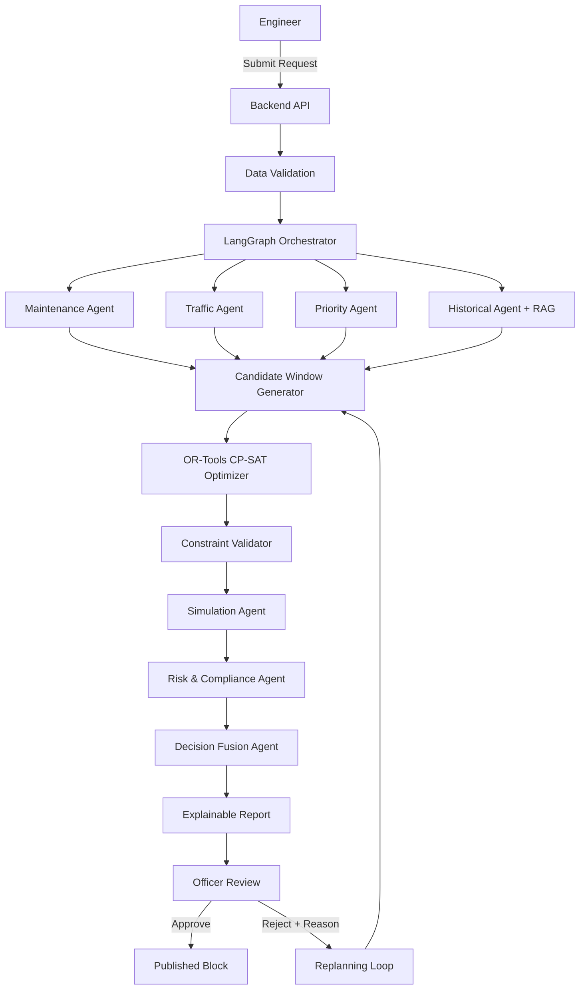

# RailSync AI

**AI-Powered Automatic Railway Maintenance Block Planning System**

Built for SIH 2026 - A fully working prototype demonstrating multi-agent AI + optimization + RAG + human-in-the-loop railway maintenance planning.

## Architecture

```
ENGINEER raises maintenance requirement
    ↓
RAILSYNC AI understands + retrieves + analyzes
    ↓
MULTI-AGENT ANALYSIS (Maintenance + Traffic + Priority + Historical)
    ↓
OR-TOOLS CP-SAT finds mathematically feasible optimal window
    ↓
SIMULATION predicts train impact
    ↓
RISK + COMPLIANCE validates safety and operational risk
    ↓
EXPLAINABLE REPORT
    ↓
OFFICER reviews → APPROVE or REJECT
    ↓
if rejected: OFFICER FEEDBACK → RAILSYNC AI REPLANS → NEW PLAN VERSION
    ↓
OFFICER approves → PUBLISHED MAINTENANCE BLOCK
```

## Tech Stack

| Layer | Technology |
|-------|-----------|
| Frontend | React 18, TypeScript, Tailwind CSS, Framer Motion, Recharts, Socket.IO Client |
| Backend | Python, FastAPI, Uvicorn, SQLAlchemy, Pydantic |
| AI/ML | LangGraph, LangChain, Groq API (optional), FAISS |
| Optimization | Google OR-Tools CP-SAT |
| Database | SQLite (zero-config local demo) |
| Real-time | WebSocket (Socket.IO compatible) |

## AI Agents

| Agent | Responsibility |
|-------|---------------|
| Maintenance Agent | Analyzes maintenance requirements, resources, constraints |
| Traffic Agent | Analyzes train schedules, conflicts, delays |
| Priority Agent | Ranks request by safety, urgency, operational impact |
| Historical Agent | Retrieves similar cases, rules, recommendations via RAG |
| Candidate Generator | Generates feasible maintenance windows |
| CP-SAT Optimizer | Mathematically selects optimal window using OR-Tools |
| Constraint Validator | Deterministically validates all constraints |
| Simulation Agent | Simulates train impact, delays, rerouting |
| Risk & Compliance Agent | Evaluates safety, operational, passenger risk |
| Decision Fusion Agent | Synthesizes all analysis into explainable recommendation |

## Key Features

- **End-to-End Workflow**: Engineer → AI → Officer → Approve/Reject → Replan → Publish
- **Multi-Agent AI**: 10 specialized agents working in pipeline
- **OR-Tools CP-SAT**: Mathematical optimization for schedule selection
- **RAG/FAISS**: Knowledge retrieval from railway rules and historical cases
- **Human-in-the-Loop**: Officer feedback becomes new AI planning constraint
- **Version Control**: Every plan version preserved, never overwritten
- **Explainable AI**: Every recommendation explains "why this window"
- **Live Ops Simulator**: Playback-controlled train simulation with held trains, delays and conflict detection
- **Field Execution Lifecycle**: Sanction → Engineer Check-in → Activate → Release → Complete, with IR-style Block Notice & Caution Order (Form T-409) artifacts
- **Dynamic Re-Planning**: Live premium-train conflict triggers automatic AI re-planning, routed to the officer for re-approval
- **Live Weather Advisory**: Open-Meteo integration feeds current conditions into the plan risk report
- **Demo Mode**: Works without external API keys using deterministic agents

## Quick Start

### Prerequisites
- Python 3.10+
- Node.js 18+

### Backend Setup

```bash
cd backend
pip install -r requirements.txt
python -m main
```

Backend runs on http://localhost:8000

### Frontend Setup

```bash
cd frontend
npm install
npm run dev
```

Frontend runs on http://localhost:5173

### Demo Credentials

| Role | Email | Password |
|------|-------|----------|
| Engineer | engineer@railsync.in | engineer123 |
| Officer | officer@railsync.in | officer123 |

### Demo Scenario

1. Login as Engineer (engineer@railsync.in / engineer123)
2. Click "Raise Block Request"
3. Fill form (defaults match demo scenario) → Submit
4. Click "Start AI Analysis" → Watch agents execute
5. Logout
6. Login as Officer (officer@railsync.in / officer123)
7. Click "Review Plan" on pending request
8. Click "Reject & Request Replanning"
9. Enter: "Avoid 10:00-13:00 due to passenger train" → Submit
10. See AI replan with new version
11. Click "Approve Plan" → See block published
12. Click "Sanction Block & Generate Notice" → Notice + caution order issued
13. Visit "Live Ops" → see live train board, sanctioned block, speed/pause/jump controls
14. Login as Engineer → Live Ops → "Check In" → "Activate Block" → watch block go LIVE and held trains get delayed
15. "Release Line" → "Complete" closes the block
16. (Officer) On a fresh conflict, click "Trigger Dynamic Re-Plan (AI)" → new compliant version goes to review

### Automated Demo Tests

Two end-to-end tests run against a live backend (exit 0 = PASS, 1 = FAIL):

```
cd backend
python demo_scenario.py   # full AI planning + reject/replan/approve flow
python demo_live.py       # Ops lifecycle + live sim + dynamic replan
```

`demo_scenario.py` covers the planning workflow; `demo_live.py` covers sanction → field lifecycle → live board conflict handling → dynamic re-planning. Restart the backend before each for a clean run.

## API Endpoints

| Endpoint | Method | Description |
|----------|--------|-------------|
| /api/auth/login | POST | User login |
| /api/requests | POST | Create maintenance request |
| /api/requests | GET | List all requests |
| /api/requests/:id | GET | Get request details |
| /api/requests/:id/analyze | POST | Start AI analysis |
| /api/requests/:id/agents | GET | Get agent results |
| /api/requests/:id/report | GET | Get planning report |
| /api/requests/:id/history | GET | Get version history |
| /api/officer/pending | GET | Get pending reviews |
| /api/plans/:id/approve | POST | Approve plan |
| /api/plans/:id/reject | POST | Reject plan with reason |
| /api/plans/:id/replan | POST | Trigger replanning |
| /api/dashboard/engineer | GET | Engineer dashboard |
| /api/dashboard/officer | GET | Officer dashboard |
| /api/execution/plans/:id | GET | Block execution session |
| /api/execution/plans/:id/sanction | POST | Officer sanctions block, emits Notice + Caution Order |
| /api/execution/plans/:id/checkin | POST | Engineer on site (IN_POSITION) |
| /api/execution/plans/:id/activate | POST | Track possession taken (BLOCK_ACTIVE) |
| /api/execution/plans/:id/release | POST | Line released (RELEASED) |
| /api/execution/plans/:id/complete | POST | Block completed & closed |
| /api/live/state | GET | Live simulation snapshot (trains, blocks, conflicts, events) |
| /api/live/speed | POST | Set playback speed |
| /api/live/running | POST | Pause / resume simulation |
| /api/live/jump | POST | Fast-forward simulated clock |
| /api/live/weather | GET | Live weather advisory (Open-Meteo) |
| /api/live/dynamic-replan/:id | POST | Trigger AI dynamic re-plan on live conflict |
| /ws/:request_id | WebSocket | Real-time updates |

## Environment Variables

| Variable | Default | Description |
|----------|---------|-------------|
| DEMO_MODE | true | Use deterministic agents (no LLM) |
| GROQ_API_KEY | (empty) | Groq API key for real LLM |
| DATABASE_URL | sqlite:///./railsync.db | Database connection |
| SECRET_KEY | railsync-secret-key... | JWT secret |
| FRONTEND_URL | http://localhost:5173 | Frontend URL for CORS |

## Project Structure

```
railsync-ai/
├── backend/
│   ├── app/
│   │   ├── api/          # FastAPI route handlers
│   │   ├── agents/       # 10 AI agent modules
│   │   ├── auth/         # JWT authentication
│   │   ├── database/     # SQLAlchemy setup
│   │   ├── graph/        # LangGraph workflow
│   │   ├── models/       # Database models
│   │   ├── optimization/ # OR-Tools CP-SAT
│   │   ├── rag/          # FAISS knowledge base
│   │   ├── schemas/      # Pydantic schemas
│   │   ├── simulation/   # Train impact simulation
│   │   ├── websocket/    # WebSocket handler
│   │   └── config.py     # Configuration
│   ├── main.py           # FastAPI entry point
│   ├── scripts/          # Database seeding
│   └── requirements.txt
├── frontend/
│   ├── src/
│   │   ├── components/   # Reusable components
│   │   ├── hooks/        # React hooks
│   │   ├── pages/        # Page components
│   │   ├── services/     # API client
│   │   ├── types/        # TypeScript types
│   │   ├── App.tsx       # Router
│   │   └── main.tsx      # Entry point
│   └── package.json
├── .env
└── README.md
```

## Architecture Diagram



## License

Prototype for SIH 2026. Not for production use.
